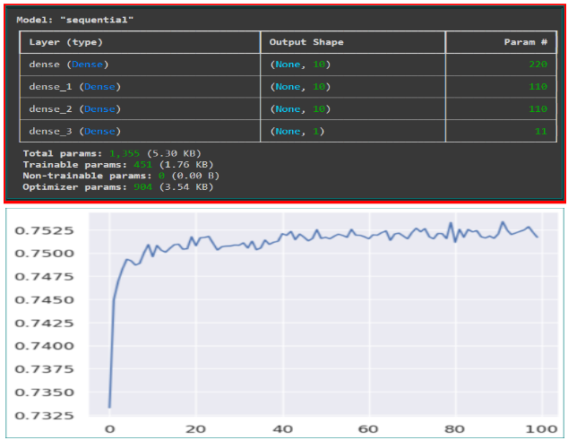
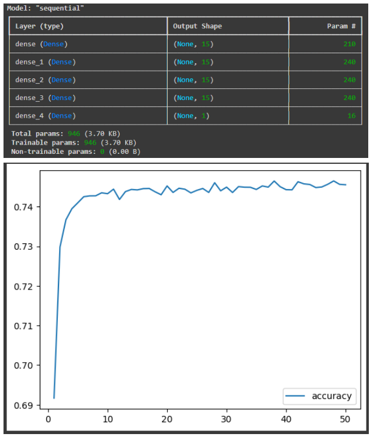
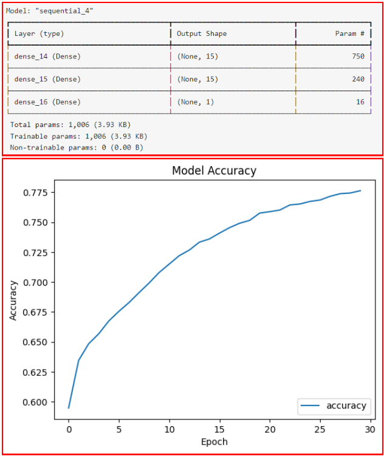

# Diabetes_Admission_Analysis
 
Overview:  
&emsp;The goal of our project was to build a model that determined the readmission rates of diabetic patients. We used two datasets; one was based on 30-day readmission rates of diabetic patients, and the other on diabetic health indicators. As a group, we applied our knowledge of supervised and unsupervised machine learning algorithms to build a model using Python.  
&emsp;The intended audience is the Board of Directors at a 100 bed hospital. The Board has requested each hospital department to develop an internal plan to help with their CMS ranking (Centers for Medicare and Medicaid Services ranking). In addition, the CMS ranking is used to guarantee insurance services for patients at that location. If this ranking drops, the insurance company will no longer accept patient claims from the hospital.  
The diabetic population was selected as our focus group since this population is statistically more at risk of hospital mortality, and increased length of hospital stay. Patients with diabetes have delayed wound healing and an increased probability of infection (Jang, Kim, Kang, Heo, Kim, & Park, 2024). Thus, it is important to keep this population as stable as possible, and decrease their chances of preventable rehospitalization. Therefore, we wanted to develop a model that would be able to predict readmission rates when diabetic patients enter the ER.  
&emsp;We designed our proposed model with the intention of taking all the Triage data from incoming Emergency Department patients. Our model would screen these incoming patients regardless of their reason for admission. Our model aims to add preventative care measures to pre-diabetic patients that may not be aware of their compromised state. This would help patient placement services determine room availability in the hospital, as well as applying individualized care plans for these patients to prevent further readmission. This model can be used to further highlight the reasons why diabetic patients are readmitted, and work towards preventing it from happening. In conjunction, understanding readmission rates can help alleviate additional stresses to the healthcare team. Reducing preventable hospitalization, reduces the amount of patients that are hospitalized. Thus, it would create a potential environment with safer staffing ratios, better patient experience and more timely care (McHuge, Berez, Small, 2013). Which would in turn, increase the CMS ranking.  
  
# Diabetes_Admission_Analysis

# Project Description:
The goal of the model was to determine all at risk patients with diabetes and determine their risk of readmission. We used two datasets; one was based on 30-day readmission rates of diabetic patients, and the other on diabetic health indicators. 

Presentation link:
https://docs.google.com/presentation/d/1Q3656UAtHDe7sN4Jnhmd1PNTc6dMPuSGojHrLyTVnRo/edit#slide=id.g2f3b66f883a_0_245

Datasets:
CDC Diabetes Health Indicators:
https://archive.ics.uci.edu/dataset/891/cdc+diabetes+health+indicators

Diabetes 130-US for years 1999-2008
https://archive.ics.uci.edu/dataset/296/diabetes+130-us+hospitals+for+years+1999-2008

#Data Description and Features: 

Description of the data:
Two datasets were used to build our model. The first dataset contained healthcare statistics and lifestyle survey information about patients with diabetes. The second dataset reviews 10 years of data (1999-2008) looking at the clinical care at 130 hospitals. The overall goal of our intented model was to determine the readmission rate of a diabetic patient within 30 days of discharge. 

Key Features of the data in CDC Diabetes Health Indicators: 

Data details
--- Main element ---
Diabetes
--- Binary elements ---
HighBP
High Cholesterol 
CholCheck
Smoker
Stroke
HeartDiseaseorAttack
PhysActivity
Fruits- Consume at least one fruit per day 
Veggies- Consume at least one vegetable per day 
HvyAlcoholConsump
AnyHealthcare
NoDocbcCost
DiffWalk
Sex → (0 = female, 1 = male)

--- Integer Elements ---  
BMI - 12-98  
GenHlth (Self reported value)  
1 = excellent  
2 = very good  
3 = good  
4 = fair  
5 = poor  
MentHlth - Mental Health in the last 30 days  
PhysHlth - Physical Health in the last 30 days  

Age [1-13] - (filled in using CDC Master List, grouping 18-19, 20-24) [* indicated field given with original data]  
1   = 18-24  
2  =  25-29  
3  =  30-34  
4  =  35-39  
5  = 40-44  
6  = 45-49  
7  = 50-54  
8  = 55-59  
9  = 60-64  
10 = 65-69  
11 = 70-74  
12 = 75-79  
13 =  80 or older  
  
Education [1-6]  
&emsp;1 = Never attended school or only kindergarten  
 2 = Grades 1 through 8 (Elementary)  
 3 = Grades 9 through 11 (Some high school)  
 4 = Grade 12 or GED (High school graduate)  
 5 = College 1 year to 3 years (Some college or technical school)  
 6 = College 4 years or more (College graduate)  
Income [1-8]  
&emsp;1 = less than 10,000  
&emsp;5 = less than 35,000  
&emsp;8 = $75,000 or more  

Key features of Diabetes 130-US for years 1999-2008  
Encounter ID- unique identifier of an encounter  
Patient_nbr- unique identifier of a patient  
Race  
Gender  
Age  
Weight  
Admission type id- integer identifier corresponding to where patient was admitted  
Discharge disposition id- integer identifier to where the patient was discharged to  
Admission source id- integer identifier corresponding to there source of admission  
Time in hospital- integer number of days between admission and discharge  
Payer code- integer identifier corresponding to 23 distinct values  
Medical specialty -integer identifier of a speciality of the admitting physician  
Num lab procedures- number of lab tests performed during the encounter  
Num procedures- number of the procedures (other than lab tests) performed during the encounter  
Num medications- number of distinct generic names administered during the encounter   
Number outpatient- number of outpatient visits of the patient in the year preceding the encounter  
Number emergency- number of emergency visits of the patient in the year preceding the encounter  
Number inpatient- number of inpatient visits of the patient in the year preceding the encounter  
Diag 1- primary diagnosis (ICD code)  
Diag 2- additional diagnosis (ICD code)  
Diag 3- additional diagnosis (IDC code)  
Number diagnosis  
Max glucose serum  
A1C result  
Medications  
Metformin  
Repaglinide  
Nateglinide  
Chlorpropamide  
Glimepiride  
Acetohexamide  
Glipizide  
Glyburide  
Tolbutamide  
Pioglitazone  
Rosiglitazone  
Acarbose  
Miglitol  
Troglitazone  
Tolazamide  
Examide
Citoglopton  
Insulin  
Glyburide-metformin  
Glipizide-metformin  
Glimepiride-pioglitazone  
Metformin-rosiglitazone  
metformin-pioglitazone  
Change - change in diabetic medication prescribed   
Diabetes medication - indicates there was diabetic medication prescribed  
Readmitted (Target column)  

Data Import and Preparation:  
Import:  
The data from the datasets were uploaded as CSV files. These datasets were manipulated by each group member using various supervised models to build a model with the highest accuracy rate. 

Preparation:   
The dataset CDC Diabetes Health Indicators was imported in three reversions. The first one was a raw dataset containing all the original information about diabetic patients. The second was clearned into a binary state, and the third was normalized into a 50/50 population for training purposes. Diabetes 130-US for years 1999-2008 data was imported in two datasets. The first dataset contained all the raw data, and the second dataset contained the IDS mapping codes. These mapping codes were not used in our model. A significant amount of diagnostic and medication columns were dropped. These columns were dropped since the information is not needed for prediction and would contaminate the model. 

# Questions to Investigate:
Each group member cleaned their data in various ways in order to explore what columns should remain in the model, and which areas could be dropped based on overall importance. Through individual exploration of the data and group discussion, each student cleaned and dropped various columns of data to improve their model. 
The group was split and each team worked on one of the datasets. After each team reviewed their team’s datasets and collaborated. Each group member used a number of different predictive models (Random Forest, KMeans, K Nearest Neighbor, Logistic Regression, Neural Network (Deep Learning)) to manipulate their data.
It was found through analyzing the data, that all the models approached the same accuracy limit of 75.5% when using the Diabetic Health Indicators Dataset. Conversely, when using the Readmission Dataset, the accuracy of all the models was in the 50’s, except for when Extremely Random Trees was used. This classifier was able to give an accuracy score of 89.2%. However, the data was very overfit. Due to these results, there is a limit of what the data can predict for our model. An increase in accuracy would require improvements in the available data, this would include more tailored regional data specific to individual hospitals.

Dataset 1, Model 1, Augustine Ojo  

Dataset 1, Model 2, Nathan Bauer  

Similarly, for the second data set...

Dataset 2, model 1, Gustav van der Westhuizen  

# Conclusions and Future Development  

**The results and conclusions of the analysis:**  
This model can be used to further highlight the reasons why diabetic patients are readmitted, and work towards preventing it from happening. Not only can it help target at-risk patients within the hospital, but its predictive nature can be utilized to streamline the care process and alleviate bottlenecks with resources and staff before they happen. 

**Plan for future development:**  
These models can be applied to the Initiate Triage charting system when patients are Triaged in the Emergency Department. This model would then generate automatic predictions on all incoming patiences.  For the patients that are at risk of diabetes and readmittance, their charts and be flagged for follow up once the attending physician has been assigned. 
If it is determined that the patient is at risk, the attending can prescribe mitigating treatment specifically targeted to that patient's need. This treatment could include a social worker, diabetic educator, registered dietitian, pharmacist and case management. 

# Reference:  
Jang, S.A., Kim, K.M., Kang, H.J., Heo, S.J., Kim, C.S., & Park, S.W. (2024). Higher mortality and longer length of stay in hospitalized patients with newly diagnosed diabetes. Diabetes Research and Clinical Practice, 201, https://doi.org/10.1016/j.diabres.2024.111601  
McHuge, M.D., Berez, J., Small, D.S (2013). Hospitals With Higher Nurse Staffing Had Lower Odds Of Readmissions Penalties Than Hospitals With Lower Staffing. Health Affairs, 32, 1740-1747.  

